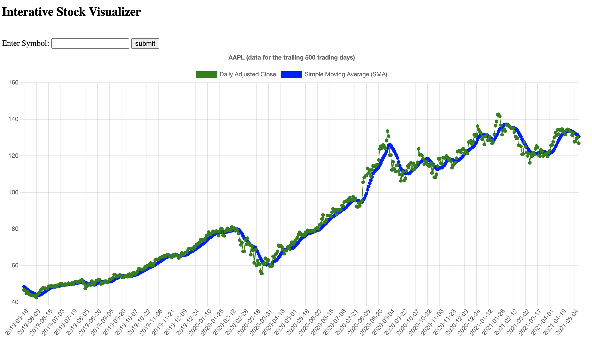
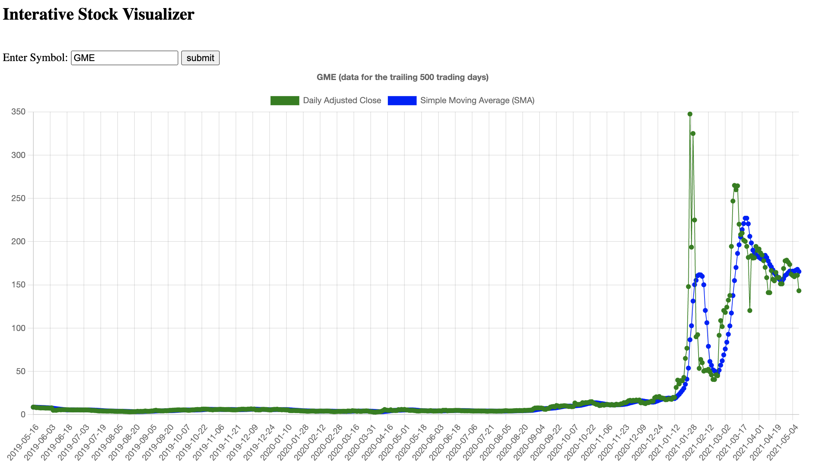

# Building a Stock Visualization Website with Python/Django and Alpha Vantage APIs



Table of content:
- Install dependencies and set up project
- Create database model
- Create frontend UI for the homepage
- Create backend logic
- Set up Django URL routing
- Run the web application locally

## Install Dependencies and set up project
We recommend **Python 3.6 or higher**. If you do not yet have Python installed, please follow the download instructions on the official [python.org](https://www.python.org/downloads/) website. 

Once you have Python installed in your environment, please use your command line interface to install the following 2 Python libraries: 
- [Django](https://www.djangoproject.com/download/): `pip install django`
- [requests](https://pypi.org/project/requests/): `pip install requests`

The `pip` installer above should already be automatically included in your system if you are using Python 3.6 or higher downloaded from python.org. If you are seeing a "pip not found" error message, please refer to the [pip installation guide](https://pip.pypa.io/en/stable/installing/). 

If you haven't done so, please obtain a free Alpha Vantage API key [here](https://www.alphavantage.co/support/#api-key). You will use this API key to query financial market data from the Alpha Vantage APIs as you develop this Python/Django website. 

Now, we are ready to create the Django project! 

Open a new command line window and type in the following prompt: 
```shell
(home) $ django-admin startproject alphaVantage
```

You have just created a blank Django project in a folder called `alphaVantage`. 

Now, let's switch from your home directory to the `alphaVantage` project directory with the following command line prompt: 
```shell
(home) $ cd alphaVantage
```

For the rest of this project, we will be operating inside the `alphaVantage` root directory. 

Now, let's create a `stockVisualizer` app within the blank Django project:  
```shell
(alphaVantage) $ python manage.py startapp stockVisualizer
```

We will also create an HTML file for our homepage. Enter the following 4 command line prompts in order: 

Step 1: create a new folder called "templates"
```shell
(alphaVantage) $ mkdir templates
```

Step 2: go to that folder
```shell
(alphaVantage) $ cd templates
```

Step 3: create an empty `home.html` file in the `templates` folder

If you are in Mac or Linux:  
```shell
(templates) $ touch home.html
```
If you are in Windows:  
```shell
(templates) $ type nul > home.html
```

Step 4: return to our `alphaVantage` root directory
```shell
(templates) $ cd ../
``` 

At this stage, the file structure of your Django project should look similar to the one below. You may want to import the project into an IDE such as PyCharm, Visual Studio Code, or Sublime Text to visualize the file structure more easily. 

```
alphaVantage/
    alphaVantage/
        __init__.py
        asgi.py
        settings.py
        urls.py
        wsgi.py
    stockVisualizer/
        migrations/
            __init__.py
        __init__.py
        admin.py
        apps.py
        models.py
        tests.py
        views.py
    templates/
        home.html
    manage.py
```

Let's take a closer look at some of the key files: 
- `manage.py`: A command-line utility that lets you interact with this Django project in various ways. You can read all the details about manage.py in [django-admin and manage.py](https://docs.djangoproject.com/en/3.2/ref/django-admin/).
- `__init__.py`: An empty file that tells Python that this directory should be considered a Python package. Please keep it empty! 
- `settings.py`: Settings/configuration for this Django project.
- `urls.py`: The URL declarations for this Django project; a “table of contents” of your Django-powered site. 
- `models.py`: this is the file you will use to define database objects and schema
- `views.py`: this is where all the backend logic gets implemented and relayed to the frontend (views)
- `home.html`: the HTML file that determines the look and behavior of the homepage


## Specify the database model
Databases are essential components of most modern web and mobile applications. For our stock visualization website, we will create a simple (two-column) database model to store stock market data. 

Before we create the database model, however, let's open the `settings.py` file and quickly modify the following 3 places in the script: 


1. Near the top of `settings.py`, add a line of code `import os`: 
```python
from pathlib import Path
import os #add this line to settings.py
```

2. Inside the `INSTALLED_APPS`, add the `stockVisualizer` app: 
```python
INSTALLED_APPS = [
    'django.contrib.admin',
    'django.contrib.auth',
    'django.contrib.contenttypes',
    'django.contrib.sessions',
    'django.contrib.messages',
    'django.contrib.staticfiles',
    'stockVisualizer', #add this line to settings.py
]
```

3. Inside `TEMPLATES`, include the `templates` directory we've created earlier in this project: 
```python
TEMPLATES = [
    {
        'BACKEND': 'django.template.backends.django.DjangoTemplates',
        'DIRS': [os.path.join(BASE_DIR, 'templates')], #modify this line in settings.py
        'APP_DIRS': True,
        'OPTIONS': {
            'context_processors': [
                'django.template.context_processors.debug',
                'django.template.context_processors.request',
                'django.contrib.auth.context_processors.auth',
                'django.contrib.messages.context_processors.messages',
            ],
        },
    },
]
```

Now, let's define a Django database model called `StockData` in `models.py`. 

The model has two fields:
- a `symbol` field that stores the ticker string of the stock
- a `data` field that stores the historical prices and moving average values for a given ticker

```python
#models.py

from django.db import models

# Create your models here.
class StockData(models.Model):
    symbol = models.TextField(null=True)
    data = models.TextField(null=True)
```

With `models.py` updated, let's notify Django about the newly created database model via the following command line prompts: 
```shell
(alphaVantage) $ python manage.py makemigrations
```
```shell
(alphaVantage) $ python manage.py migrate
```

At this stage, your file structure should loook similar to the one below: 
```
alphaVantage/
    alphaVantage/
        __init__.py
        asgi.py
        settings.py
        urls.py
        wsgi.py
    stockVisualizer/
        migrations/
            0001_initial.py #you should see this after running the database migration commands
            __init__.py
        __init__.py
        admin.py
        apps.py
        models.py
        tests.py
        views.py
    templates/
        home.html
    manage.py
    db.sqlite3 #you should see this after running the database migration commands
```

The `db.sqlite3` file indicates that we have registered our `StockData` model in the local SQLite database. As its name suggests, SQLite is a lightweight SQL database frequently used for developing web applications (especially in local test environment). SQLite is automatically included in Django/Python, so there is no need to install it separately :-) 

At this stage, there are only two major steps left:
- Set up the homepage file (home.html) so that we can visualize stock prices and moving averagas of a given stock
- Create the backend logic (views.py) so that we have the proper stock data to feed into the frontend UI

Let's proceed! 

## Set up the homepage 

Before we dive into the code implementation, let's first summarize the expected behavior of our homepage (screenshots below) at a high level: 
- Upon loading, the page will display the adjusted close prices and simple moving average (SMA) values of Apple (AAPL), covering the most recent 500 trading days. 
- When the user enters a new stock ticker in the textbox and hits "submit", the existing chart on the page will be replaced with the adjusted close and SMA data of the new ticker.

(When the homepage is first loaded)


(When the user enters a new symbol such as GME)



With the above page layout and behavior in mind, let's implement the homepage frontend accordingly. Open the (empty) `home.html` and paste the following content into it: 
```html
<!DOCTYPE html>
<html>
<head>
    <!--<link rel="stylesheet" href="style.css">-->
    <script src="https://cdn.jsdelivr.net/npm/chart.js@3.2.1/dist/chart.min.js"></script>
    <script src="https://code.jquery.com/jquery-3.6.0.min.js"></script>
    <title>Stock Visualizer</title>
</head>

<body>
<h2>Interative Stock Visualizer</h2>
<br>

<label for="ticker-input">Enter Symbol:</label>
<input type="text" id="ticker-input">
<input type="button" value="submit" id="submit-btn">
<br>

<div id="graph-area" style="height:80%; width:80%;">
<canvas id="myChart"></canvas>
</div>
<br>

<div>
    Friendly reminder: if the graphing function stops working after several successful instances, don't worry! It is likely that you have reached the 5 requests/minute rate limit of the free Alpha Vantage API key. The graph should work again in the next minute or after you obtain a <a href="https://www.alphavantage.co/premium/" target="_blank">premium API key</a> with a higher rate limit.
</div>

<script>

    $(document).ready(function(){
        // Right after the page is loaded, we get the stock data (default to AAPL) from the Django backend (the 'get_stock_data' function) for plotting
        $.ajax({
              type: "POST",
              url: "/get_stock_data/",
              data: {
                 'ticker': 'AAPL',
              },
              success: function (res, status) {
                var tickerDisplay = res['prices']['Meta Data']['2. Symbol'];
                var graphTitle = tickerDisplay + ' (data for the trailing 500 trading days)'

                var priceSeries = res['prices']['Time Series (Daily)'];
                var daily_adjusted_close = [];
                var dates = [];

                price_data_parse = function(){
                    for (let key in priceSeries) {
                        daily_adjusted_close.push(Number(priceSeries[key]['5. adjusted close']));
                        dates.push(String(key));
                    }

                };
                price_data_parse();

                var smaSeries = res['sma']['Technical Analysis: SMA'];
                var sma_data = [];

                sma_data_parse = function(){
                    for (let key in smaSeries) {
                        sma_data.push(Number(smaSeries[key]['SMA']));
                    }

                };
                sma_data_parse();


                daily_adjusted_close.reverse().slice(500);
                sma_data.reverse().slice(500);
                dates.reverse().slice(500);

                //make a graph
                var ctx = document.getElementById('myChart').getContext('2d');
                var myChart = new Chart(ctx, {
                type: 'line',
                    data: {
                        labels: dates.slice(-500),
                        datasets: [
                            {
                                label: 'Daily Adjusted Close',
                                data: daily_adjusted_close.slice(-500),
                                backgroundColor: [
                                    'green',
                                ],
                                borderColor: [
                                    'green',
                                ],
                                borderWidth: 1
                            },
                            {
                                label: 'Simple Moving Average (SMA)',
                                data: sma_data.slice(-500),
                                backgroundColor: [
                                    'blue',
                                ],
                                borderColor: [
                                    'blue',
                                ],
                                borderWidth: 1
                            },
                        ]
                    },
                    options: {
                        responsive: true,
                        scales: {
                            y: {
                                //beginAtZero: false
                            }
                        },
                        plugins: {
                            legend: {
                            position: 'top',
                            },
                            title: {
                            display: true,
                            text: graphTitle
                            }
                        }
                    }
                });

              }
        });
    });

    $('#submit-btn').click(function() {
        // when the user specifies a new ticker, we call the Django backend (the 'get_stock_data' function) to get the stock data and refresh the graph. 
        var tickerText = $('#ticker-input').val();
        $.ajax({
              type: "POST",
              url: "/get_stock_data/",
              data: {
                 'ticker': tickerText,
              },
              success: function (res, status) {
                var tickerDisplay = res['prices']['Meta Data']['2. Symbol'];
                var graphTitle = tickerDisplay + ' (data for the trailing 500 trading days)'

                var priceSeries = res['prices']['Time Series (Daily)'];
                var daily_adjusted_close = [];
                var dates = [];

                price_data_parse = function(){
                    for (let key in priceSeries) {
                        daily_adjusted_close.push(Number(priceSeries[key]['5. adjusted close']));
                        dates.push(String(key));
                    }

                };
                price_data_parse();

                var smaSeries = res['sma']['Technical Analysis: SMA'];
                var sma_data = [];

                sma_data_parse = function(){
                    for (let key in smaSeries) {
                        sma_data.push(Number(smaSeries[key]['SMA']));
                    }

                };
                sma_data_parse();


                daily_adjusted_close.reverse().slice(500);
                sma_data.reverse().slice(500);
                dates.reverse().slice(500);

                //make a graph
                $('#myChart').remove(); // this is my <canvas> element
                $('#graph-area').append('<canvas id="myChart"><canvas>');
                var ctx = document.getElementById('myChart').getContext('2d');
                var myChart = new Chart(ctx, {
                type: 'line',
                    data: {
                        labels: dates.slice(-500),
                        datasets: [
                            {
                                label: 'Daily Adjusted Close',
                                data: daily_adjusted_close.slice(-500),
                                backgroundColor: [
                                    'green',
                                ],
                                borderColor: [
                                    'green',
                                ],
                                borderWidth: 1
                            },
                            {
                                label: 'Simple Moving Average (SMA)',
                                data: sma_data.slice(-500),
                                backgroundColor: [
                                    'blue',
                                ],
                                borderColor: [
                                    'blue',
                                ],
                                borderWidth: 1
                            },
                        ]
                    },
                    options: {
                        responsive: true,
                        scales: {
                            y: {
                                //beginAtZero: false
                            }
                        },
                        plugins: {
                            legend: {
                            position: 'top',
                            },
                            title: {
                            display: true,
                            text: graphTitle
                            }
                        }
                    }
                });

              }
        });


    });

</script>

</body>
</html>
```

This is a chunky block of code! Don't worry - it basically completes the following 4 tasks: 

1. Load the Javascript dependencies: 
-  `<script src="https://cdn.jsdelivr.net/npm/chart.js@3.2.1/dist/chart.min.js"></script>` loads the powerful [Chart.js library](https://www.chartjs.org/) for data visualization 
- `<script src="https://code.jquery.com/jquery-3.6.0.min.js"></script>` loads the [jquery library](https://jquery.com/) that streamlines common frontend development tasks. 

2. Define the page layout
- `<input type="text" id="ticker-input">` is the input text box for a user to enter a new stock ticker
- `<input type="button" value="submit" id="submit-btn">` is the submit button
- `<canvas id="myChart"></canvas>` is the canvas on which Chart.js will generate the beautiful graph for stock data visualization

3. Define the behavior upon page loading

The `$(document).ready(function(){...}` code block specifies the page behavior when it's first loaded:
- First, it will make an AJAX POST request to a Django backend function called `get_stock_data` to get the price and simple moving average data for AAPL. AJAX stands for Asynchronous JavaScript And XML, which is a popular Javascript design pattern that enables you to (1) update a web page without reloading the page, (2) request data from a backend server - after the page has loaded, (3) receive data from a backend server - after the page has loaded, among other benefits. 
- Once AAPL's data is returned by the backend to the frontend (the data is stored in the `res` variable of `success: function (res, status) {...}`), it is parsed by several lines of Javascript codes into three lists: `dates`, `daily_adjusted_close`, and `sma_data`. 
- The three lists above are then all truncated into a size of 500 elements (i.e., data for the trailing 500 trading days) to be visualized by Chart.js. Specifically, the values in `dates` are used for the X axis; values in `daily_adjusted_close` and `sma_data` are used for the Y axis. 


4. Define the behavior for when a new ticker is submitted by the user

The `$('#submit-btn').click(function(){...}` code block specifies the page behavior when a user enters a new ticker symbol: 
- First, it will make an AJAX POST request to a Django backend function called `get_stock_data` to get the price and simple moving average data for the ticker entered by the user. The line `var tickerText = $('#ticker-input').val();` takes care of extracting the ticker string from the input textbox. 
- Once the ticker's data is returned by the backend to the frontend (the data is again stored in the `res` variable of `success: function (res, status) {...}`), it is parsed by several lines of Javascript codes into three lists: `dates`, `daily_adjusted_close`, and `sma_data`. 
- The three lists above are then all truncated into a size of 500 elements (i.e., data for the trailing 500 trading days) to be visualized by Chart.js. Specifically, the values in `dates` are used for the X axis; values in `daily_adjusted_close` and `sma_data` are used for the Y axis. 


You may be wondering where the `get_stock_data` backend function is. Please hold your breath - we will implement it right away! 

## Set up Django backend (views.py)


views.py
```python
from django.shortcuts import render
from django.http import HttpResponse
from django.views.decorators.csrf import csrf_exempt
from .models import StockData

import requests
import json


APIKEY = 'my_alphav_api_key' 
#replace 'my_alphav_api_key' with your actual Alpha Vantage API key obtained from https://www.alphavantage.co/support/#api-key


DATABASE_ACCESS = True 
#if False, the app will always query the Alpha Vantage APIs regardless of whether the stock data for a given ticker is already in the local database


# Create your views here.
def home(request):
    return render(request, 'home.html', {})

@csrf_exempt
def get_stock_data(request):
    if request.is_ajax():
        ticker = request.POST.get('ticker', 'null')
        ticker = ticker.upper()

        if DATABASE_ACCESS == True:
            #checking if the database already has data stored for this ticker before querying the Alpha Vantage API
            if StockData.objects.filter(symbol=ticker).exists(): 
                #We have the data in our database! Get the data from the database directly and send it back to the frontend AJAX call
                entry = StockData.objects.filter(symbol=ticker)[0]
                return HttpResponse(entry.data, content_type='application/json')

        #obtain stock data from Alpha Vantage APIs
        output_dictionary = {}
        
        #get adjusted close data
        price_series = requests.get(f'https://www.alphavantage.co/query?function=TIME_SERIES_DAILY_ADJUSTED&symbol={ticker}&apikey={APIKEY}&outputsize=full').json()
        
        #get SMA (simple moving average) data
        sma_series = requests.get(f'https://www.alphavantage.co/query?function=SMA&symbol={ticker}&interval=daily&time_period=10&series_type=close&apikey={APIKEY}').json()

        #package up the data as a dictionary 
        output_dictionary['prices'] = price_series
        output_dictionary['sma'] = sma_series

        #save the dictionary to database
        temp = StockData(symbol=ticker, data=json.dumps(output_dictionary))
        temp.save()

        #return the data back to the frontend AJAX call 
        return HttpResponse(json.dumps(output_dictionary), content_type='application/json')

    else:
        message = "Not Ajax"
        return HttpResponse(message)

```

## URL routing
urls.py
```python
from django.contrib import admin
from django.urls import path
import stockVisualizer.views

urlpatterns = [
    path('admin/', admin.site.urls),
    path("", stockVisualizer.views.home),
    path('get_stock_data/', stockVisualizer.views.get_stock_data),
]
```

## Running the website locally
```shell
(alphaVantage) $ python manage.py runserver
```


You should have a fully functional Django web application at http://localhost:8000/

## References


